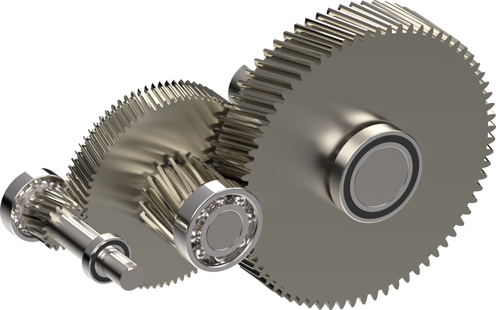

# MAS413_Gearbox

*Project for the MSc. course MAS413 Machine Systems 1*

SolidWorks render of the gearbox design by group 8:
- Thomas Lønne Stiansen
- Adrian Mathias Lervik Ling
- Ruben Kristoffer Helgestad
- Ole Tobias Næss

# Given Requirements

The gearbox is driven by an electric motor and a requirement is that the piston pump should be in operation for 8 to 10 hours per day, with the following requirements:
- Speed of input shaft: n = 1450 [rpm]
- Power on input shaft: P = 12.5 [kW]
- Total gear ratio: i_t = 17.3 [-]
- Pressure Angle: alpha = 20 [degrees]
- Helix Angle: beta = 15 [degrees]

# Scripts
The iterative process described in the report follows quite directly from the code in the "Scripts" directory

# CAD
- 3D models were made parameterized under the following file "Solidworks/SolidWorks_Variables_Equations.txt"
- For compatibility issues with group members using Windows, Unix and Mac OS, the CAD files were shared through OneDrive and not here
- To keep the system simple, these files are added in the .gitignore such that one can copy the files into the "SolidWorks" folder and compile them directly there